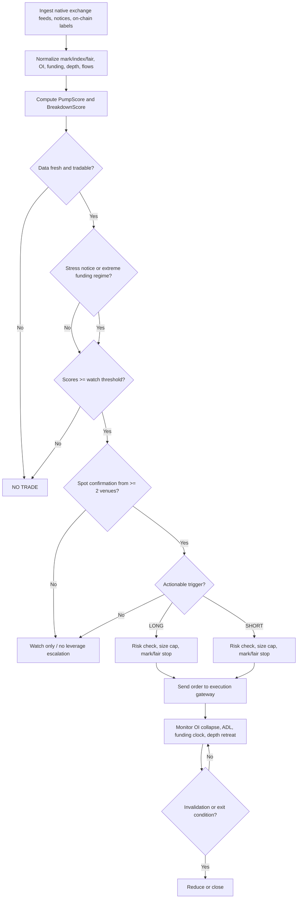
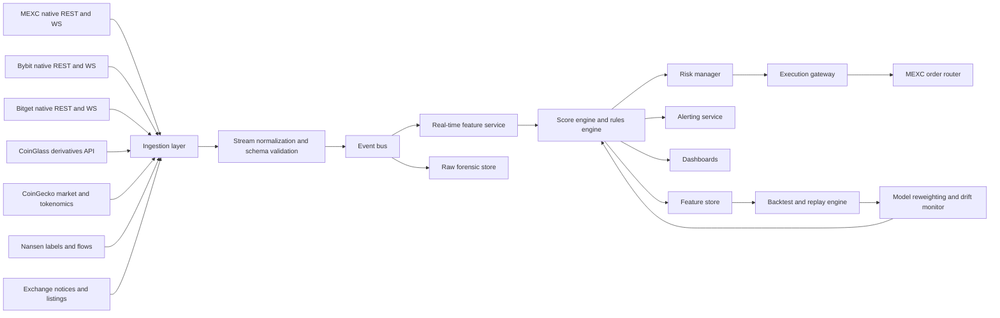

# Extreme Perp Swap Pump and Breakdown Detection Research

## Executive Summary

The highest-confidence precursor to extreme low-to-mid-cap perp moves is not social chatter, not generic “high funding,” and not raw volume. It is **exchange risk-engine stress becoming visible before the crowd understands why**. In the gathered cases, two signals stood out far above the rest: **venue-side parameter intervention** and **structural float fragility**. On entity["company","MEXC","crypto exchange"], SIRENUSDT and BULLAUSDT both had funding settlement frequency tightened to abnormal levels, including **1-hour settlements with ±3% funding caps**, while MEXC also reduced maximum leverage on BULLAUSDT from **50x to 20x** and on SIREN from **100x to 50x**. Those are not cosmetic changes. They are venue-level acknowledgements that the contract has become difficult to anchor to spot and that liquidation risk is no longer routine. citeturn35search1turn36search3turn36search0turn41search1turn3search6

The second recurring precursor is **an extremely fragile supply-and-liquidity structure**. CoinGecko’s token pages for RAVE and BULLA show low effective tradable float relative to total supply, with large locked or vesting balances, while BULLA’s page explicitly surfaces named locked wallets and RAVE’s page shows a large vesting balance. In that environment, modest changes in CEX balances, cross-venue listings, or perp crowding can create a one-sided order-book vacuum that moves far faster than standard momentum models assume. citeturn8search0turn10search0

For Matrix Trader, the core implication is operational: **treat exchange notices and contract-parameter changes as first-class alpha inputs**, not as compliance metadata. A funding-interval cut, a leverage cap reduction, or a risk-limit change should immediately re-rank a symbol into a “contract stress” watchlist and force recalculation of the symbol’s squeeze/breakdown probability. This is especially important on MEXC because liquidation and unrealized PnL are driven by **fair price**, not just the last traded price, and because funding deductions can move liquidation prices directly. citeturn5search1turn4search0

The case studies suggest two dominant archetypes. The first is the **engineered squeeze archetype**: low float, thin spot depth, rising OI relative to visible depth, abnormal funding and premium behavior, and a large nearby liquidation ladder above price. The second is the **post-squeeze failure archetype**: the same symbol later collapses when late longs replace trapped shorts, exchange deposits increase, or early concentrated holders distribute into retail demand. RAVE and SIREN most clearly illustrate the first archetype turning into the second; BULLA is the cleanest breakdown case; KAT is more useful as a **control case** than as a pure “RAVE-style” event, because the gathered material shows broader major-venue spot depth, transparent scheduled unlocks, and less direct evidence of MEXC-style emergency stress than in RAVE, SIREN, and BULLA. citeturn13search6turn12search2turn14search0turn11search2turn37search0turn15search5

The practical change for Matrix Trader is therefore straightforward. The system should stop thinking in terms of “trend strength” and start thinking in terms of **tradable fragility**. The most important features are: exchange stress notices, OI relative to book depth, float concentration, CEX flow imbalance, basis/premium dislocations, liquidation-map asymmetry, and whether spot venues are confirming or refusing the perp move. The least important features are generic social volume, headline counts, and unsegmented long/short ratios without venue, depth, and concentration context. citeturn35search1turn36search1turn41search3turn38search3turn38search10turn29search10

## Exchange Mechanics and Case Study Findings

The recurrent pattern before extreme one-sided moves is best described as **structural fragility meeting derivatives over-occupation**. In the gathered material, the recurring hard signals were: exchange funding-interval changes, leverage cuts, concentrated or partially locked supply, thin or asymmetric spot depth, and liquidation ladders that were large relative to visible liquidity. Those conditions matter more than narrative because they change the mechanics of how a move propagates through mark price, fair price, liquidation logic, and ADL risk. citeturn35search1turn36search1turn41search1turn5search1turn4search1

| Recurrent precursor | What was directly observed | Why it matters for detection |
|---|---|---|
| Exchange stress intervention | MEXC shifted SIRENUSDT to 4-hour funding on April 1, then to 1-hour funding with ±3% caps on April 4, later back to 4-hour funding on April 20; BULLAUSDT saw 1-hour funding on February 24, then 4-hour again on February 26; MEXC also cut leverage on SIREN and BULLA. citeturn36search3turn35search1turn36search0turn41search3turn40search0turn41search1turn3search6 | This is the strongest machine-readable stress flag because the exchange is explicitly telling you that basis control and liquidation risk have become abnormal. |
| Low effective float | RAVE showed 248.0M circulating out of 1.0B total with a 751.9M vesting balance; BULLA showed 280.0M circulating out of 1.0B total with large named locked wallets; KAT showed a large locked balance with scheduled token unlocks. citeturn8search0turn10search0turn11search2 | Low float means perp positioning can dominate price discovery long before broad spot participation arrives. |
| Venue expansion/listing ignition | KuCoin listed RAVE spot on April 17; Bitget launched KATUSDT futures on March 18; Coinbase International Exchange lists KAT-PERP in its product specifications. citeturn34search2turn37search0turn15search5 | New venues change reachable demand, borrow availability, and cross-venue basis behavior. |
| Liquidation clustering | CoinGlass exposes pair and aggregated liquidation maps, heatmaps, and history endpoints specifically for this purpose. citeturn38search3turn38search10turn38search9 | Large, near-price liquidation ladders create reflexive market-order flow when touched. |
| Depth fragility | CoinGecko exposes market-pair tickers including spread and “cost to move” / depth-style fields; Bybit and Bitget publish granular order-book depths over REST and WebSocket; MEXC exposes depth and snapshot endpoints plus incremental depth streams. citeturn29search10turn21search0turn21search5turn22search1turn27search0 | If OI notional is large relative to visible depth, a squeeze or flush can become vertical. |
| On-chain flow asymmetry | Nansen supports address labels, smart-money netflows, and token flow intelligence including CEX transfers and exchange-category flows. citeturn21search4turn39search2turn39search5 | Exchange deposits tend to matter more before breakdowns; exchange withdrawals matter more before squeezes if float is already tight. |

**RAVEUSDT**

| Question | Observed facts | Inference |
|---|---|---|
| What happened? | KuCoin listed RAVE/USDT spot on April 17, 2026 at 07:00 UTC. CoinGecko shows RAVE reached an all-time high of **$27.88 on April 18, 2026**. KuCoin flash citing CoinGlass reported **$20.64M of 24-hour liquidations**, of which **$18.34M were shorts**, and said RAVE open interest fell **83%** from an April 11 peak of 150M tokens to 25.49M tokens on April 18. CoinGecko also shows only **248.0M** RAVE circulating against **1.0B** total supply, with a large vesting balance. citeturn34search2turn8search0turn13search6 | The rally was mechanically consistent with a low-float short squeeze rather than a broad, organic repricing. The subsequent OI collapse indicates the squeeze aged and began to exhaust itself before the crowd recognized the fragility. citeturn8search0turn13search6 |
| Earliest detectable warning signs | Low effective float and large vesting overhang were visible before the vertical move, and the KuCoin listing time was known in advance. citeturn8search0turn34search2 | The best early warning was the combination of **tight float + venue expansion**, not the later candle shape. |
| Which signals came first? | Structural supply imbalance and listing catalyst came before the reported liquidation spike and before the OI collapse. citeturn8search0turn34search2turn13search6 | Matrix Trader should have promoted RAVE into a “fragile new-listing squeeze watchlist” before the final vertical phase. |
| Which signals were fake or low value? | Public reporting around insider transfers and manipulation allegations existed, but this report did not retrieve first-party wallet exports reproducing those claims directly. Public reports should therefore be treated as **unconfirmed here** until independently verified in Nansen or Arkham. citeturn33search8turn33search9 | Social traction alone would have been a late or noisy signal; the system should downweight it unless backed by wallet-label evidence. |
| Best early entry, confirmation, invalidation | Observed: short liquidations dominated while OI later collapsed hard. citeturn13search6 | **Best early entry:** the first post-listing pullback while float stayed tight and same-side depth stayed thin. **Best confirmation:** price up with nearby short-liq heatmap heavy, then OI flattening or falling as price still rises. **Best invalidation:** price still rising but OI starts expanding again on the long side and spot depth broadens materially, which means the move is no longer a pure squeeze. |
| Where did retail usually enter too late, and where did forced liquidations accelerate? | Retail was most likely to enter after venue expansion and after price became visibly parabolic; liquidations accelerated when the short ladder was hit, with the bulk of reported 24-hour liquidations on the short side. citeturn34search2turn13search6 | The proper exit logic was not “hold the parabola,” but “take size off into OI collapse and before the crowd treats the squeeze as a new fundamental trend.” |

**SIRENUSDT**

| Question | Observed facts | Inference |
|---|---|---|
| What happened? | MEXC reduced SIREN leverage from **100x to 50x** on March 22, 2026. It then set SIRENUSDT funding to **4-hour** settlement on April 1, **1-hour** settlement with **±3%** caps on April 4, and later back to **4-hour** settlement on April 20. KuCoin flash citing CoinGlass reported that on April 17 SIREN surged **174%** to **$2.278**, then dropped **88%** to **$0.271**, with **$7.14M** of liquidations over 24 hours. Public reports also described a whale withdrawing **31.55M SIREN** from Binance Alpha over roughly two weeks, but that specific wallet flow was not reproduced directly from first-party exports in this report. citeturn3search6turn36search3turn35search1turn36search0turn12search2turn32search2 | SIREN is the clearest case where **exchange parameter changes themselves** were the earliest usable machine signal. The later whale-withdrawal story may have mattered, but the exchange stress notices mattered first and were easier to trust operationally. |
| Earliest detectable warning signs | Leverage reduction on March 22; funding-frequency interventions on April 1 and April 4. citeturn3search6turn36search3turn35search1 | If a symbol gets repeated contract-parameter interventions inside a few weeks, Matrix Trader should treat it as structurally unstable even if spot looks healthy. |
| Which signals came first? | First came leverage reduction, then funding-frequency changes, then the later pump-and-collapse sequence. citeturn3search6turn36search3turn35search1turn12search2 | The signal hierarchy should rank **leverage/funding regime shifts above candle-based breakout logic**. |
| Which signals were fake or low value? | Public narratives around AI/meme momentum and non-reproduced whale-flow claims are lower-confidence here than official MEXC notices. citeturn35search1turn3search6turn32search2 | The system should not fire aggressive entries from narrative trend alone when exchange stress has already gone abnormal. |
| Best early entry, confirmation, invalidation | Observed: 1-hour funding with ±3% caps was active on MEXC; later MEXC normalized back to 4-hour funding on April 20. citeturn35search1turn36search0 | **Best early entry:** not the first vertical candle, but the first post-intervention expansion where spot confirms and OI/depth stays extreme. **Best confirmation:** funding regime stays abnormal while spot also follows, proving it is not a single-venue last-price artifact. **Best invalidation:** parameter normalization, failure of spot confirmation, or a sharp rise in fresh long OI after the breakout. |
| Where did retail usually enter too late, and where did forced liquidations accelerate? | Retail was late once the symbol was already printing triple-digit daily gains. The reported 88% collapse shows that the move later flipped into a long-liquidation event after the rally phase. citeturn12search2 | SIREN shows why the bot must distinguish **squeeze continuation** from **late-long replacement**. The latter is where breakdown setups appear. |

**BULLAUSDT**

| Question | Observed facts | Inference |
|---|---|---|
| What happened? | MEXC cut BULLAUSDT max leverage from **50x to 20x** on January 31, 2026. KuCoin flash reported that BULLA later **plummeted 90% overnight**, with market cap falling from nearly **$400M** to **$22M** in eight hours. MEXC moved BULLAUSDT to **4-hour** funding on February 5, to **1-hour** funding with **±3%** caps on February 24, then back to **4-hour** funding on February 26. CoinGecko shows only **280.0M** BULLA circulating out of **1.0B**, with large named locked wallets. citeturn41search1turn14search0turn40search1turn41search3turn40search0turn10search0 | BULLA is the cleanest **breakdown archetype** in the gathered set: concentrated supply, exchange risk interventions, and then a fast collapse. |
| Earliest detectable warning signs | Leverage reduction came before the major failure. Low float and named locked wallets were visible on tokenomics data. citeturn41search1turn10search0 | A leverage cut on a thin-float meme perp should be interpreted as a high-risk warning, not as “safer conditions.” |
| Which signals came first? | First came structural concentration and leverage reduction; later came the more explicit funding-frequency stress changes. citeturn10search0turn41search1turn41search3turn40search0 | For breakdown detection, leverage cuts plus concentration should immediately raise short-bias watch priority. |
| Which signals were fake or low value? | A sharp sentiment-led rise on its own was not reliable; KuCoin had also reported a **96%** BULLA surge on January 29, which could have looked like strength without context. citeturn14search2 | Trend following without contract-stress context would likely have bought the top. |
| Best early entry, confirmation, invalidation | Observed: exchange leverage and funding interventions were explicit and time-stamped. citeturn41search1turn41search3turn40search0 | **Best early entry for breakdown:** when price starts losing support after the leverage cut and depth does not broaden. **Best confirmation:** 1-hour funding intervention plus renewed exchange-deposit pressure or bid-depth retreat. **Best invalidation:** material improvement in spot depth and float distribution, which was not evidenced in the gathered material. |
| Where did retail usually enter too late, and where did forced liquidations accelerate? | Retail was likely latest after the 96% surge and near the local peak; the reported 90% overnight collapse is typical of long-liquidation acceleration in a fragile book. citeturn14search2turn14search0 | BULLA argues for a broad “do not chase after leverage cuts” rule in Matrix Trader. |

**KATUSDT**

| Question | Observed facts | Inference |
|---|---|---|
| What happened? | Bitget launched KATUSDT futures on March 18, 2026 with **20x** max leverage and **4-hour** funding settlement. Coinbase International Exchange product specs list **KAT-PERP** with **25x** max leverage and an index that updates every second. CoinGecko shows a large liquid spot market on major venues, and a scheduled unlock of **176.79M KAT on May 18**, representing **1.8% of total supply**. The gathered material does **not** show a verified RAVE/SIREN/BULLA-class MEXC emergency stress cycle for KAT. citeturn37search0turn15search5turn11search2 | KAT is more valuable as a **benchmark/control case** than as a confirmed extreme-manipulation case. It helps teach the model what a large-token rally looks like when spot depth is broader and venue stress notices are less extreme. |
| Earliest detectable warning signs | Scheduled unlocks and venue-perp expansion were known. citeturn11search2turn37search0turn15search5 | In KAT-like names, unlock-risk and venue-expansion probably matter more than “emergency squeeze” features. |
| Which signals came first? | Futures availability and transparent tokenomics came first. citeturn37search0turn11search2 | The signal order is less pathological here, so KAT should live in the training set as a “hard rally, not necessarily a trap” example. |
| Which signals were fake or low value? | Treating every strong KAT move as a RAVE-style manipulation would be a false positive. citeturn11search2turn37search0 | Matrix Trader needs a no-trade branch specifically for liquid majors or deeper mid-caps where the same candle shape does **not** imply the same structural fragility. |
| Best early entry, confirmation, invalidation | Observed facts only support unlock and market-structure monitoring; a full “ideal squeeze entry” is **uncertain** for KAT in this report. citeturn11search2turn15search5 | The correct use of KAT is model calibration: if your pump detector scores KAT the same way as BULLA or SIREN, the model is overfitting to price shape instead of structure. |

## Data Requirements and Vendor Stack

Primary live sources should be exchange-native feeds from entity["company","Bybit","crypto exchange"] and entity["company","Bitget","crypto exchange"] as well as MEXC, with cross-venue normalization from entity["company","CoinGlass","market data platform"], token/liquidity metadata from entity["company","CoinGecko","market data platform"], and labeled on-chain intelligence from entity["company","Nansen","blockchain analytics firm"]. Use entity["company","CoinMarketCap","market data platform"] and exchange news from entity["company","KuCoin","crypto exchange"] as secondary mapping and catalyst sources when native coverage is incomplete. Official public API details for entity["company","Arkham","blockchain analytics platform"] were not reliably surfaced in the gathered material, so Arkham should be treated as **optional and uncertain until commercially validated**. citeturn20search0turn21search0turn23search1turn18search6turn29search10turn21search4turn30search0turn34search2

### Data feeds and vendors

| Feed | Exact source or endpoint | Minimum live cadence | Retention target | Priority | Notes |
|---|---|---:|---:|---|---|
| Exchange notices and contract-parameter changes | MEXC announcements pages; Bitget support notices; venue listing notices | 30–60s poll | Indefinite | Critical | This feed should drive regime flags before any price logic. citeturn35search1turn36search3turn41search1turn37search0turn34search2 |
| MEXC futures core tape | `api/v1/contract/ticker`, `.../funding_rate/{symbol}`, `.../funding_rate/history`, `.../index_price/{symbol}`, `.../fair_price/{symbol}`, `.../depth/{symbol}`, `.../depth_commits/{symbol}/{N}`, WS `sub.tickers`, `sub.deal`, `sub.funding.rate`, `sub.index.price`, `sub.fair.price` | 100ms–1s | 30–90d raw, 2y features | Critical | MEXC is the execution venue, so native feeds outrank aggregators for decisioning. citeturn27search0turn28search0turn20search0 |
| Bybit derivatives control tape | `/v5/market/open-interest`, `/v5/market/funding/history`, `/v5/market/orderbook`, WS `orderbook.{depth}.{symbol}` | 10–200ms WS; 5m+ REST history | 30–90d raw, 2y features | High | Best as a comparative venue to test whether a move is localized or broad. citeturn21search2turn21search6turn21search5turn21search0 |
| Bitget derivatives control tape | `/api/v3/market/open-interest`, `/api/v3/market/current-fund-rate`, `/api/v3/market/history-fund-rate`, WS `books/books1/books5/books15` | 10–150ms WS; 1s poll for critical REST endpoints | 30–90d raw, 2y features | High | Strong for cross-checking whether MEXC stress is idiosyncratic. citeturn23search1turn23search2turn23search4turn22search1turn22search0 |
| Aggregated derivatives data | CoinGlass OI history, basis history, liquidation history, heatmap, top/global long-short ratios, large orderbook | 1m–5m | Depends on plan; store locally for 2y | Critical | Use for normalized cross-venue OI, liquidation, basis, and heatmap features. citeturn18search7turn18search3turn38search10turn38search3turn38search2turn38search5turn18search5 |
| Tokenomics and liquidity metadata | CoinGecko `/coins/{id}/tickers`, WebSocket `CGSimplePrice`, `OnchainTrade`, `OnchainOHLCV` | 0.1s–1s WS; 10–60s REST | 2y | High | Good for spot market mapping, cost-to-move fields, token supply data, and DEX flow context. API coverage for some website exchange-flow widgets is **uncertain**. citeturn29search10turn29search8turn29search4turn29search1 |
| On-chain labels and flow intelligence | Nansen `/api/v1/profiler/address/labels`, `/api/v1/smart-money/netflow`, `/api/v1/tgm/flows`, `/api/v1/tgm/flow-intelligence` | 5m poll; hourly snapshots for some flows | 2y | High | This is the preferred source for smart-money, exchange-flow, and holder-segment features. citeturn21search4turn39search2turn39search4turn39search5 |
| Broad market and exchange mappings | CoinMarketCap `/v1/exchange/market-pairs/latest`, exchange and global market endpoints | 60s–5m | 2y | Medium | Best as a broad fallback and mapping source, not as primary execution data. citeturn30search3turn30search0turn30search2 |

### Vendor comparison and commercial constraints

| Vendor | Best use | Latency or freshness | Cost and rate profile | Limitations |
|---|---|---|---|---|
| Native exchange APIs | Lowest-latency execution and order-book reconstruction | Exchange WebSockets run from ~10ms to 200ms on surfaced docs | Usually free, venue-specific limits | Narrow history, schema differences, partial outages, no cross-venue normalization. citeturn21search0turn22search1turn20search0 |
| CoinGlass | Cross-venue perp normalization, OI, funding, basis, liquidations, heatmaps | Official pricing page says updates are **≤1 minute** | $29/mo to $699/mo, 30 to 1,200 req/min depending on plan; history range depends heavily on plan | Lower-interval history is plan-gated; public web pages are dynamic and not sufficient for forensic reconstruction without API export. citeturn26search0turn18search7turn38search10 |
| CoinGecko | Tokenomics, spot market mapping, supply/unlock context, light real-time WS | Demo/public ~30 calls/min; paid plans from 10-second to real-time freshness; WebSocket on higher tiers | Demo plus paid plans from roughly $29–$499 monthly-equivalent on surfaced pricing | Exchange-flow widget endpoint coverage is not fully clear from surfaced docs; use for metadata and spot context, not primary low-latency execution. citeturn17search0turn31search0turn29search0 |
| Nansen | Address labels, smart-money flows, token flow intelligence | Rate limits documented at 20 rps and 300 rpm | Pro starts at $49 annual / $69 monthly plus credits | Excellent on-chain context, but not a replacement for native exchange derivatives feeds. citeturn25search0turn25search3turn39search2turn39search5 |
| CoinMarketCap | Wide exchange and market mapping, backup OHLCV and exchange-pair coverage | Most surfaced endpoints update every minute; some global endpoints every 5 minutes | Free to $699/mo by plan | Exchange market-pairs endpoint requires higher plans; not suitable as the primary live derivatives engine. citeturn30search1turn30search3turn30search0 |
| Arkham | Potential entity clustering and wallet investigation | Uncertain | Uncertain | Official public API pricing and docs were not reliably surfaced in the gathered material. Treat as optional until validated. |

## Feature Engineering and Detection Framework

**Observed facts**

The gathered evidence says the useful precursor variables are the ones that either describe **contract stress** or **tradable float stress**. Exchange interventions on SIREN and BULLA show that funding and leverage regimes must be modeled as state variables. MEXC’s fair-price system and ADL mechanics mean that mark or fair-price dislocations matter more than raw last-trade prints. CoinGlass’s liquidation and basis endpoints, CoinGecko’s tokenomics and pair-level liquidity fields, and Nansen’s exchange-flow intelligence together provide the minimum dataset needed to turn those observations into machine features. citeturn35search1turn36search1turn41search1turn5search1turn4search1turn38search3turn29search10turn39search5

**Inference: seed features for Matrix Trader**

The table below is a **seed specification**, not a claim of already-validated optimal thresholds. Wherever a threshold is not well grounded by surfaced first-party evidence, it is marked as a suggested seed value or **unspecified**.

| Feature | Formula | Lookback | Seed threshold | Interpretation |
|---|---|---|---|---|
| OI/Depth ratio | `OIDR = OI_notional / (depth_+1pct_bid + depth_-1pct_ask)` | rolling live | `>8` warning, `>12` extreme | High OI relative to visible liquidity means liquidation cascades can move vertically. |
| Same-side depth coverage | `SDC_up = ask_depth_+1pct / OI_notional`, `SDC_down = bid_depth_-1pct / OI_notional` | rolling live | `<0.10` fragile | Thin same-side depth makes continuation and failure both more violent. |
| Funding z-score | `z_f = (f_t - mean(f))/std(f)` | 21 settlements or 7d | `|z_f| > 2.5` warning, `>4` extreme | Captures funding extremity relative to the symbol’s own regime. |
| Funding regime change flag | `1` if funding interval or max/min caps change within last 72h | 72h | binary | Highest-priority venue stress feature. |
| Hourly funding shock | `shock = abs(f_t) * (8 / interval_hours)` | latest settlement | `>1.0%` 8h-equiv extreme | Normalizes 1h, 4h, and 8h funding to a common intensity. |
| OI compression flag | `OI_range_24h / OI_mean_24h < 0.10` and realized vol in bottom 20% | 24h | binary | Compression often precedes expansion when the book is thin. |
| OI expansion flag | `ΔOI_2h / OI_t-2h` | 2h | `>15%` | Strong if paired with thin depth; ambiguous without basis and spot confirmation. |
| Price–OI divergence sequence | `ΔP_30m` vs `ΔOI_30m` | 30m | context-driven | Price up while OI down after prior build often signals squeeze continuation; price up while OI up without spot confirmation often signals exhaustion risk. |
| Cumulative liquidation heat | `CLH_up/down = nearby_liq_notional / traded_notional_24h` | 24h map | `>0.25` warning, `>0.50` extreme | Measures how much forced flow sits near price. |
| ADL pressure index | If private bars available: `25 * lit_bars`; otherwise proxy from stress flags | live | `>=50` warning, `>=75` extreme | Public venue-wide ADL data is **unspecified**, so use account-level bars or a proxy. |
| Free-float contraction metric | `1 - est_exchange_tradable_float / circulating_supply` | 24h + static tokenomics | `>0.70` high risk | High values mean less supply is realistically available on exchange. |
| Whale concentration score | rescaled composite of top wallets and largest cluster share | daily | `>70` high, `>85` extreme | Critical for separating healthy momentum from controlled float. |
| Exchange-deposit delta | `(CEX_inflow_24h - CEX_outflow_24h) / circulating_supply` | 24h | `>+0.5%` breakdown risk, `<-0.5%` squeeze risk | Deposits usually increase available sell inventory; withdrawals often tighten float. |
| Spot–perp basis anomaly | `(mark - spot_vwap) / spot_vwap` | 7d z-score | `|z| > 2.5` or basis `>1.5%` | Persistent dislocation means perp pressure is outrunning spot anchoring. |
| Premium-index anomaly | `(fair - index) / index` | 7d z-score | `|z| > 2.5` | Important on MEXC because fair price drives liquidation. |
| Market-maker retreat score | `z(spread) + z(-depth_change_2pct)` with cancel-rate if available | 30m | `>4` extreme | Captures widening spreads and vanishing depth. |
| Aggressive order imbalance | `buy_taker_notional / total_taker_notional` or the sell-side mirror | 1–5m | `>62%` sustained | Useful only with spot confirmation and heatmap context. |
| CVD divergence | `CVD` vs price and OI sequence | 15m–1h | **unspecified** | Helpful as a confirmer; weak as a standalone trigger on manipulated books. |
| Token unlock risk | `unlock_usd_next_30d / ADV_30d` and `unlock_tokens_next_30d / circ_supply` | 30d | `>0.5 ADV` or `>2% circ` high | Especially useful for KAT-like names with transparent schedules. |

### Pre-pump and pre-breakdown checklists

| Checklist | Conditions that should usually be present before Matrix Trader promotes the symbol from watchlist to actionable setup |
|---|---|
| Pre-pump checklist | `stress_notice=1 OR funding_z_extreme=1`; `float_fragile=1`; `OIDR>=10`; large upside liquidation heat; spot depth thin but not collapsing; exchange balances not rising sharply; price has not already traveled beyond the “late move” filter. |
| Pre-breakdown checklist | `stress_notice=1 OR token_unlock_risk_high=1 OR exchange_deposit_delta_positive=1`; `float_fragile=1`; `OIDR>=10`; downside liquidation heat large; bid depth retreating; fair/index premium weakening or turning negative; price beginning to lose support. |

### Scoring system and signal hierarchy

Use **two directional scores**, not one: `PumpScore` and `BreakdownScore`, each from 0 to 100.

`DirectionalScore = StructuralFragility(0–30) + DerivativesStress(0–35) + MicrostructureStress(0–20) + CatalystContext(0–15) - ContradictionPenalty(0–20)`

Suggested allocation:

- `StructuralFragility`: free-float contraction 10, whale concentration 10, exchange-deposit asymmetry or unlock risk 10  
- `DerivativesStress`: funding regime flag 10, OI/depth 10, liquidation heat 8, basis/premium anomaly 7  
- `MicrostructureStress`: spread/depth retreat 10, aggressive trade imbalance 5, spot-perp divergence 5  
- `CatalystContext`: new listing, futures launch, venue expansion, or major support-page change 15  
- `ContradictionPenalty`: weak spot confirmation, stale data, broad beta shock, or obvious post-parabola lateness up to 20

Suggested interpretation:

- `<45`: no trade  
- `45–64`: monitor only  
- `65–79`: setup alert  
- `80–89`: executable only with confirmation  
- `>=90`: executable but also **extreme risk**; size should usually go **down**, not up, because instability is highest

| Signal | Tier | Expected predictive power before backtest | Expected latency | Main failure mode |
|---|---|---|---|---|
| Funding interval or cap change | Tier 1 | Very high | Hours to days | Sparse sample count; venue may normalize quickly |
| Leverage reduction or risk-limit cut | Tier 1 | Very high | Hours to days | Some cuts are preventive rather than immediately directional |
| OI/Depth ratio | Tier 1 | High | Minutes to hours | False positives on deeper large caps |
| Free-float contraction and whale concentration | Tier 1 | High | Days to weeks | Slow-moving; not a trigger by itself |
| Exchange-deposit delta and labeled wallet flows | Tier 1 | High | Hours to days | Label errors; private OTC transfers |
| Liquidation heatmap asymmetry | Tier 1 | Medium-high | Minutes to hours | Heatmaps are model-based, not perfect liquidation forecasts |
| Basis or premium anomaly | Tier 2 | Medium-high | Minutes to hours | Can be venue-local and quickly mean-revert |
| Aggressive trade imbalance and CVD | Tier 2 | Medium | Seconds to minutes | Easy to spoof in thin books |
| Social sentiment and influencer traffic | Tier 3 | Low | Usually late | High manipulation and hindsight bias |
| Raw volume spike | Tier 3 | Low | Usually late | Often already in the move |

The most common professional misunderstanding is simple: **high funding is not a signal by itself**. What matters is whether high or abnormal funding is accompanied by a **regime change**, **low float**, **high OI/depth**, and **one-sided liquidation exposure**. The second common misunderstanding is that rising OI with rising price is bullish. In these names, it is often the opposite: it tells you the move is becoming crowded and that the next leg may be the failure leg.

## Backtesting and Signal Validation

Build the backtest around **events**, not around generic next-bar prediction. The target universe should include low-to-mid-cap perpetuals across MEXC, Bybit, Bitget, entity["company","Binance","crypto exchange"], and entity["company","Hyperliquid","decentralized perpetuals exchange"], with symbols grouped by market-cap band, listing age, and liquidity regime. The minimum dataset should be 1-minute normalized bars for price, OI, funding, basis, and liquidation history; full order-book snapshots and delta reconstruction for the highest-priority names; exchange notices; and daily on-chain label and flow features. Exchange-native feeds are the source of truth for live decisioning, while CoinGlass and Nansen become the source of truth for cross-venue derivatives normalization and on-chain categorization. citeturn20search0turn21search2turn23search1turn18search7turn39search5

Use explicit event labels instead of fuzzy “pump” or “dump” tags:

| Label | Suggested definition |
|---|---|
| Pre-pump event | A symbol that rises at least **+25% in 1h**, **+60% in 4h**, or **+150% in 24h** after the alert, while adverse excursion before reaching the first target stays below **20%** |
| Pre-breakdown event | A symbol that falls at least **-20% in 1h**, **-50% in 4h**, or **-80% in 24h** after the alert, while adverse excursion before first target stays below **20%** |
| Squeeze continuation | Price rises while OI flatlines or falls after a prior OI build, with upside liquidation heat concentration |
| Late-long failure | Price had a prior squeeze, then OI begins rebuilding on the long side near highs and the symbol later breaks down |
| Control rally | Strong rally without emergency venue-stress flags, used to reduce false positives |

The validation stack should include both **classification metrics** and **tradability metrics**. Classification metrics should include precision, recall, F1, AUCPR, and median lead time to the first target. Tradability metrics should include average edge at entry, maximum adverse excursion, maximum favorable excursion, Sharpe on event-driven trades, hit rate, slippage versus mark/fair price, and max drawdown under realistic partial-fill assumptions. The lead-time metric matters more than AUC for this project, because a signal that fires after a visible 40% candle is economically much worse than a slightly less accurate signal that fires two hours earlier.

Use **purged walk-forward validation** by month and venue group, not random splits. Add **leave-one-symbol-out** tests so the model cannot simply memorize RAVE, SIREN, or BULLA behavior. Add **regime segmentation**: large-cap beta shocks, macro event days, meme-week regimes, and post-listing windows. False-positive controls should include minimum tradability filters such as 24-hour spot volume, visible depth, stale-feed checks, and a rule that removes any “signal” created solely by social data without structural or venue confirmation.

## Matrix Trader Decision Logic and Automation Architecture

### Alert logic and execution rules

The bot should operate as a **rules-first system with model-assisted reweighting**, not as a black-box classifier. Exchange stress and fragility should gate whether the model is even allowed to enter high-leverage mode.

| Alert state | Exact seed rule | Priority | Cooldown | Required confirmation |
|---|---|---|---|---|
| LONG watch | `PumpScore >= 65 AND (stress_notice OR funding_z_extreme) AND float_fragile AND OIDR >= 10 AND upside_liq_loaded AND NOT late_move` | P2 | 30m | none |
| LONG actionable | LONG watch **and** `spot_confirmed_up AND aggressive_buy_share_3m >= 0.62 AND Δprice_5m > 0.03 AND ΔOI_5m <= 0.00 AND premium_z >= 2` | P1 | 20m same direction | spot confirmation from at least 2 venues |
| SHORT watch | `BreakdownScore >= 65 AND (stress_notice OR unlock_risk_high OR exchange_deposit_delta > 0.005) AND float_fragile AND OIDR >= 10 AND downside_liq_loaded AND NOT late_move` | P2 | 30m | none |
| SHORT actionable | SHORT watch **and** `spot_confirmed_down AND aggressive_sell_share_3m >= 0.62 AND Δprice_5m < -0.03 AND ΔOI_5m <= 0.00 AND premium_z <= -2` | P1 | 20m same direction | spot confirmation from at least 2 venues |
| NO TRADE | `data_stale > 5s` for venue tape, or `contradictory_scores`, or `24h_spot_volume < 2M`, or `visible_2pct_depth < 50k`, or `late_move = 1`, or signal comes only from social features | Hard block | Until reset | n/a |
| EXTREME RISK | funding interval cut to `1h`, or `±3%` cap in effect, or `ADL_pressure >= 75`, or `OIDR >= 15`, or `|premium_z| >= 4`, or `largest_cluster_share >= 0.85` | Top | 4h unless score resets | automatic size reduction |

On MEXC specifically, entries, stops, and invalidation must be tied to **fair/mark price**, not last price, because fair price is what affects liquidation and unrealized PnL. Funding payments also move liquidation price directly, and ADL can reduce positions based on profitability and effective leverage. citeturn5search1turn4search0turn4search1

### Position sizing and trade management

Use **score-based risk**, not candle-based size.

| Setup quality | Score band | Suggested effective leverage | Max account risk per trade | Entry style |
|---|---:|---:|---:|---|
| Probe | 65–74 | 15x–25x | 0.10%–0.15% equity | Starter size only |
| Standard | 75–84 | 25x–40x | 0.15%–0.25% equity | Add only on confirmation |
| High conviction | 85–89 | 40x–60x | 0.20%–0.30% equity | Use only if spot confirms |
| Extreme instability | 90+ | 60x–100x **only if notional is very small** | 0.10%–0.20% equity | Size down despite high score |

Hard execution constraints for MEXC:

- Never size above **5% of visible 1% same-side depth**.
- Never size above **2% of median 1-minute traded notional** over the prior hour.
- Do not open a fresh position inside the few minutes before funding settlement if the trade thesis depends on a crowded-side unwind.
- Use **mark/fair-price stops**, placed beyond the nearest meaningful liquidation pocket or beyond `0.6–0.8 x ATR(5m)` from fair-price VWAP.
- Reduce aggressively if account-level ADL bars rise to 3 or more.

Suggested take-profit logic:

- Take **25%–33%** at first liquidation-pocket sweep.
- Take another **25%–33%** when OI has dropped **10%–15%** from the local peak while price is still extending.
- Trail the remainder behind fair-price VWAP or a 1-minute fair-price EMA.
- Exit fully if the move flips from squeeze mechanics into fresh same-direction OI build without spot broadening.

### Decision flow



### Sample pseudocode

```python
def classify_symbol(features):
    if features.data_stale_seconds > 5:
        return "NO_TRADE"

    if features.spot_volume_24h_usd < 2_000_000:
        return "NO_TRADE"

    if features.visible_depth_2pct_usd < 50_000:
        return "NO_TRADE"

    long_watch = (
        features.pump_score >= 65 and
        (features.stress_notice or abs(features.funding_z) >= 2.5) and
        features.float_fragile and
        features.oi_depth_ratio >= 10 and
        features.upside_liq_loaded and
        not features.late_move
    )

    short_watch = (
        features.breakdown_score >= 65 and
        (features.stress_notice or features.unlock_risk_high or features.exchange_deposit_delta > 0.005) and
        features.float_fragile and
        features.oi_depth_ratio >= 10 and
        features.downside_liq_loaded and
        not features.late_move
    )

    extreme_risk = (
        features.funding_interval_hours == 1 or
        features.funding_cap_abs >= 0.03 or
        features.adl_pressure >= 75 or
        features.oi_depth_ratio >= 15 or
        abs(features.premium_z) >= 4 or
        features.largest_cluster_share >= 0.85
    )

    if long_watch and features.spot_confirmed_up:
        if (
            features.aggressive_buy_share_3m >= 0.62 and
            features.price_change_5m >= 0.03 and
            features.oi_change_5m <= 0 and
            features.premium_z >= 2
        ):
            return "LONG_EXTREME_RISK" if extreme_risk else "LONG"

    if short_watch and features.spot_confirmed_down:
        if (
            features.aggressive_sell_share_3m >= 0.62 and
            features.price_change_5m <= -0.03 and
            features.oi_change_5m <= 0 and
            features.premium_z <= -2
        ):
            return "SHORT_EXTREME_RISK" if extreme_risk else "SHORT"

    return "WATCH"
```

### Architecture for Matrix Trader



### Engineering SLAs for production

| Component | Target SLA | Failure response |
|---|---|---|
| Exchange notice ingestion | p95 under 60s from publication detection | Freeze high-leverage mode on symbols with missing notice data |
| MEXC WS normalization lag | p95 under 500ms | Fail over to REST snapshot and reduce size |
| Cross-venue WS normalization lag | p95 under 750ms | Keep signal but downgrade confidence |
| Feature computation | p95 under 250ms after event arrival | Drop to watch-only mode if missed twice in a row |
| Alert dispatch | p95 under 1s from actionable classification | Queue and timestamp for forensic audit |
| Execution gateway to venue ACK | p95 under 300ms after send | Cancel-or-reprice logic if late |
| Data freshness guard | hard fail if native venue tape stale >5s; on-chain stale >15m | NO TRADE |
| Clock drift | under 100ms | Block execution until NTP recovers |

These are **engineering targets**, not observed venue guarantees.

## Risk Controls, Monitoring, Deployment, and Roadmap

MEXC-specific mechanics need to sit inside the risk engine, not outside it. MEXC documents that fair price is the median of funding premium, mid-price basis fair price, and last price, and that fair price affects liquidation and unrealized PnL. MEXC also documents that funding deductions can affect liquidation price, that ADL prioritizes positions using profit percentage and effective leverage, and that higher maintenance-margin tiers are driven by position size rather than simply the user-selected leverage multiple. In practice, this means a Matrix Trader stop keyed only to last price is structurally wrong on MEXC. citeturn5search1turn4search0turn4search1turn4search3turn4search4turn20search0

### Monitoring, logging, and forensic replay

The system should log raw exchange payloads, sequence IDs, reconstructed books, mark/index/fair values, funding clocks, all feature snapshots used at the time of decision, score decompositions, rule results, order requests, venue acknowledgements, fills, account-level ADL bars, liquidation price, risk-tier at entry, and any human overrides. Raw tick and book data should stay hot for **30–90 days**, compressed in cold storage for **at least 1 year**, while feature-store snapshots and decision logs should be kept for **2 years or more** to support event replay and model-drift analysis.

The core dashboards should include:

- a **contract stress board** for funding interval, leverage changes, risk notices, OI/depth, and premium anomalies  
- a **liquidation board** for heatmaps above and below price  
- a **flow board** for exchange deposits, withdrawals, whale labels, and smart-money netflows  
- an **execution board** for mark-vs-last slippage, venue ACK latency, and ADL state  
- a **post-event board** for false positives, missed events, and signal lead time

Forensic replay should be **event sourced**. Every alert must be reproducible from stored raw feed messages and the exact model/rules version that was live.

### Testing and deployment

Use four steps:

1. **Historical replay** with full event reconstruction and no execution  
2. **Live shadow mode** with alerts only and synthetic fills using fair/mark-aware logic  
3. **Small capped production** on MEXC with strict size gates and manual kill switch  
4. **Full automation** only after enough post-event reviews show stable precision and acceptable drawdown

Every extreme event should trigger a same-day postmortem answering three questions: Did the model see the setup early enough? Did it overestimate tradability? Did it correctly recognize when the setup stopped being a squeeze and became an exhaustion trap?

### Blindspots and adversarial scenarios

| Failure mode | Detection heuristic | Mitigation |
|---|---|---|
| Spoofed order books | Large top-of-book notional appears and disappears within 1–2s without prints; spread widens after the spoof leaves | Weight committed depth and depth persistence more than displayed depth; require trade-through confirmation |
| Fake OI expansion | One venue OI surges without corresponding spot activity, cross-venue OI share becomes abnormally concentrated | Use cross-venue OI share and spot confirmation gates; downgrade venue-local OI jumps |
| Fake funding trap | Funding extreme but depth broadens and spot refuses to confirm | Do not enter from funding alone; require basis, heatmap, and spot checks |
| Market-maker bait setup | Price pokes breakout, aggressive prints appear, but fair/index premium does not follow | Use fair-price and premium confirmation before high leverage |
| Wash trading | Repeated equal-size prints, low trade-size entropy, volume spikes without depth change | Build wash-score and exclude low-integrity venues from confirmation logic |
| Coordinated exchange manipulation | Abnormal venue parameter changes, suspicious wallet flows, and localized basis spikes cluster together | Raise EXTREME_RISK state and cut size; demand multi-source confirmation |
| Data poisoning or stale feeds | Vendor disagreement above tolerance, out-of-order WS sequence, stale timestamp | Quarantine feed; no new orders until freshness and sequence integrity recover |
| Survivorship bias | Only studying winners or famous manipulations | Include delisted, failed, and non-event control symbols |
| Hindsight bias | Thresholds chosen after seeing the move | Lock a seed spec, then evaluate walk-forward only |
| Research bias | Overweighting social narrative or investigator threads | Keep social and public allegations at Tier 3 unless independently reproduced |

### Implementation roadmap

| Milestone | Effort | Deliverable |
|---|---|---|
| Notice harvester and parameter-regime tracker | Low, 1 week | Parser for exchange notices, leverage cuts, funding-interval changes, listing events |
| MEXC-native execution and fair-price aware risk engine | Medium, 2–3 weeks | Native market-data adapter, fair/mark stop logic, funding-clock risk logic |
| Cross-venue normalized feature store | High, 3–4 weeks | Unified OI, basis, funding, depth, liquidation, and spot confirmation features |
| On-chain label and flow integration | Medium, 2–3 weeks | Nansen adapters for labels, exchange-flow deltas, smart-money netflows |
| Event-driven backtester and replay engine | High, 3–5 weeks | Labeling, walk-forward evaluation, MAE/MFE, lead-time analytics |
| Matrix Trader alert engine and UI explanations | Medium, 2 weeks | LONG/SHORT/WATCH/NO-TRADE/EXTREME-RISK outputs with reason codes |
| Shadow trading and slippage analytics | Medium, 2 weeks | Synthetic fill engine using fair/mark-aware rules and venue ACK timing |
| Online reweighting and drift monitor | Medium, 2 weeks | Score recalibration, false-positive analysis, automatic threshold review |

### Open questions and limitations

The strongest limitations are data-specific. MEXC documents **account-level** ADL ranking and indicator behavior, but a public **market-wide** ADL feed was not identified in the surfaced materials, so venue-wide ADL pressure must be proxied unless you can access private account telemetry. Public claims about insider or whale wallet behavior in RAVE and SIREN were visible in secondary reports, but this report did not reproduce those flows directly from first-party wallet exports, so those claims should be treated as **uncertain until verified in Nansen or a validated Arkham workflow**. Exact intraday forensic reconstruction for CoinGlass-driven heatmaps and liquidation ladders will also require paid historical exports rather than public web snippets alone. citeturn4search1turn20search0turn33search8turn32search2turn38search3turn38search10